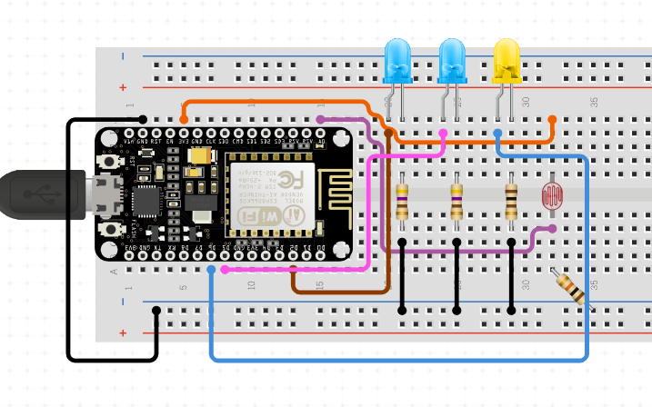

# Project README

## Project Overview

This project involves implementing a Telegram bot on the NodeMCU board to control a system that manages the watering and light system for a plant. The bot connects to Wi-Fi and allows users to perform various actions such as opening and closing the valve, toggling the light, setting schedules for automating watering and light control, and retrieving the system status by using the bot.

## Requirements to Run the Project

### Hardware Requirements
- NodeMCU board
- Three 200 ohm resistor
- Two 1 Mohm resistors
- Battery: Two 1.5V alkaline batteries
- One photoresistor
- One LED
- Valve with a DC motor
- Breadboard and jumper wires

### Software Requirements
- [Arduino IDE](https://www.instructables.com/Steps-to-Setup-Arduino-IDE-for-NODEMCU-ESP8266-WiF/)
- File [configuration](http://arduino.esp8266.com/stable/package_esp8266com_index.json) for the NodeMCU board
- Required libraries:
  - `ESP8266WiFi.h`
  - `WiFiClientSecure.h`
  - `UniversalTelegramBot.h`
  - `EEPROM.h`

## Project Layout

The project consists of a single `.ino` file containing the entire codebase.

## How to Build, Burn, and Run the Project

### Hardware setup

Pin Configuration:

- Pin D1 is connected to a resistor and its corresponding LED for simulating water control.
- Pin D2 follows the same setup as D1, connected to a resistor and another LED for additional water control simulation.
- Pin A0 is designated for the photoresistor, which detects light intensity.
- Pin D4 is utilized for controlling the lights.
> Important Note: Remember to connect Pin D0 to the RST (Reset) pin on the board to enable resetting the board.
### Software setup

1. **Install Arduino IDE:** Begin by installing the Arduino IDE. A step-by-step guide can be found [here](https://www.instructables.com/Steps-to-Setup-Arduino-IDE-for-NODEMCU-ESP8266-WiF/).

2. **Connect NodeMCU to Computer:** Use a USB cable to connect your NodeMCU board to your computer.

3. **Open Project:** Launch the Arduino IDE and open the project file for your Telegram bot.

4. **Create Telegram Bot:**
    - Open Telegram and start a conversation with the [BotFather](https://t.me/botfather) to create a new bot. Detailed instructions are available [here](https://www.directual.com/lesson-library/how-to-create-a-telegram-bot).
    - Set up the bot commands as described earlier in your conversation.

5. **Configure WiFi and Bot Token:**
    - Insert your WiFi SSID and password into the appropriate variables in your code.
    - Obtain your Telegram Bot token by following this [guide](https://www.siteguarding.com/en/how-to-get-telegram-bot-api-token) and insert it into the code.

6. **Verify and Compile:** In the Arduino IDE, verify the code for any errors and compile it.

7. **Upload Code:** With the NodeMCU still connected, upload the compiled code to the board.

8. **Activate WiFi:** Ensure your WiFi connection is active and within range of the NodeMCU board.

9. **Start Bot:** Once the code is successfully uploaded and the NodeMCU is connected to the WiFi, open Telegram and initiate a conversation with your newly created bot.

## User Guide

To interact with the Telegram bot, users can send commands to perform various actions:
- `/status` - Get the current status of the system, including LED status, light brightness, battery status, time to sleep, and valve status.
- `/water_now` - Trigger an immediate watering action.
- `/stop_watering` - Stop any ongoing watering action.
- `/set_schedule` - Set a new watering and lighting schedule. Users are prompted to send back a configuration message.
- `/cancel_schedule` - Cancel any existing watering schedule and revert to default settings.
- `/lights_on` - Turn the LED lights on to full brightness.
- `/lights_off` - Turn the LED lights off.
- `/start_config` - Save the current configuration to EEPROM and prepare the system for sleep.
- `/get_config` - Retrieve the current configuration settings.
- `/help` or `/commands` - Display a list of all available commands.

## Links

- [PowerPoint Presentation](https://docs.google.com/presentation/d/1spj2HcZenDA0uLviqj0DZPADTSwyJ2v3q2OWaiarDB0/edit?usp=sharing)
- [YouTube Video](link_to_video)

## Team Members

- **Edoardo Nicolodi**: Sole contributor to the project. Implemented the entire solution using the NodeMCU board and provided documentation.

